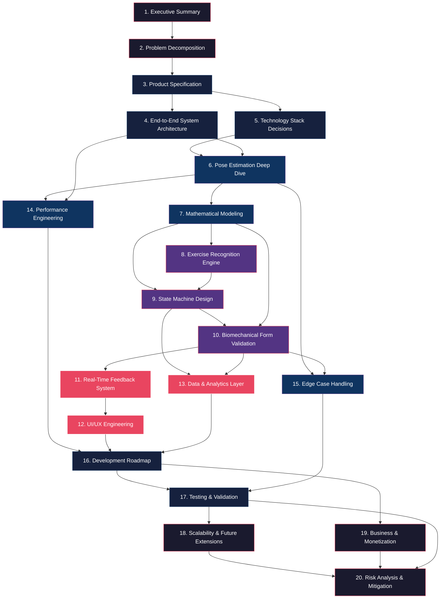

# GYMONIC — Master Workflow & Section Dependency Map

> This document defines the execution order, inter-dependencies, and connection points between all 20 blueprint sections. Use this as your roadmap — complete sections in the order shown, respecting dependency chains.

---

## Workflow Overview Diagram



---

## Execution Phases & Order

The 20 sections group into **5 execution phases**. Complete each phase before moving to the next. Within a phase, sections can be worked in parallel where shown.

---

### Phase 1: Foundation (Sections 1–3)
**Goal:** Define *what* we're building and *why*.

| Order | Section | Depends On | Produces | Artifact File |
|-------|---------|-----------|----------|---------------|
| 1 | Executive Summary | — | Product vision, scope, differentiation | `00_EXECUTIVE_SUMMARY.md` |
| 2 | Problem Decomposition | §1 | Validated problem space, failure taxonomy | `00_EXECUTIVE_SUMMARY.md` |
| 3 | Product Specification | §1, §2 | Functional/non-functional requirements | `01_PRODUCT_SPEC.md` |

**Connection to next phase:** The product spec's requirements (latency, accuracy, FPS targets) directly constrain the system architecture and technology choices in Phase 2.

---

### Phase 2: Architecture & Technology (Sections 4–6)
**Goal:** Define *how* the system is structured and *what technology* powers it.

| Order | Section | Depends On | Produces | Artifact File |
|-------|---------|-----------|----------|---------------|
| 4 | System Architecture | §3 | Full pipeline design, module I/O contracts | `02_SYSTEM_ARCHITECTURE.md` |
| 5 | Technology Stack | §3 | Justified tech selections with benchmarks | `02_SYSTEM_ARCHITECTURE.md` |
| 6 | Pose Estimation Deep Dive | §4, §5 | Landmark semantics, coordinate systems, confidence filtering | `03_POSE_ESTIMATION.md` |

**Connection to next phase:** The pose estimation output (33 landmarks with confidence scores in normalized coordinates) is the input to all mathematical modeling in Phase 3.

```
Phase 2 Output Contract:
┌──────────────────────────────────────────────────┐
│  PoseFrame {                                      │
│    landmarks: [{x, y, z, visibility, id}] × 33   │
│    timestamp: float (ms)                          │
│    frame_id: int                                  │
│    confidence: float [0.0–1.0]                    │
│  }                                                │
└──────────────────────────────────────────────────┘
         ↓ feeds into Phase 3
```

---

### Phase 3: Core Intelligence (Sections 7–10)
**Goal:** Build the mathematical and logical engines that understand human movement.

| Order | Section | Depends On | Produces | Artifact File |
|-------|---------|-----------|----------|---------------|
| 7 | Mathematical Modeling | §6 | Joint angle computation, smoothing algorithms | `04_MATH_AND_RECOGNITION.md` |
| 8 | Exercise Recognition | §7 | Classification engine (rule + ML) | `04_MATH_AND_RECOGNITION.md` |
| 9 | State Machine Design | §7, §8 | Per-exercise FSM with phase transitions, rep counting | `05_STATE_MACHINES.md` |
| 10 | Form Validation Engine | §7, §9 | Biomechanical scoring, error classification | `06_FORM_VALIDATION.md` |

**Internal data flow within Phase 3:**

```
Joint Angles (§7) ──→ Exercise Classifier (§8) ──→ State Machine (§9)
       │                                                    │
       └──────────→ Form Validator (§10) ←──────────────────┘
                          │
                    FormScore {
                      overall: float [0–100],
                      joint_scores: {joint_id: float},
                      errors: [{type, severity, message}],
                      color: GREEN | YELLOW | RED
                    }
```

**Connection to next phase:** FormScore is consumed by the feedback and UI systems in Phase 4.

---

### Phase 4: User-Facing Systems (Sections 11–15)
**Goal:** Build everything the user sees, hears, and interacts with, plus handle real-world edge cases.

| Order | Section | Depends On | Produces | Artifact File |
|-------|---------|-----------|----------|---------------|
| 11 | Feedback System | §10 | Color logic, message prioritization, audio cues | `07_FEEDBACK_AND_UI.md` |
| 12 | UI/UX Engineering | §11 | Screen designs, overlay rendering, user flows | `07_FEEDBACK_AND_UI.md` |
| 13 | Data & Analytics | §9, §10 | Rep counting, session scoring, trend tracking | `08_ANALYTICS.md` |
| 14 | Performance Engineering | §4, §6 | Latency optimization, quantization, GPU acceleration | `09_PERFORMANCE_AND_EDGE_CASES.md` |
| 15 | Edge Case Handling | §6, §10 | Occlusion mitigation, lighting adaptation, fallbacks | `09_PERFORMANCE_AND_EDGE_CASES.md` |

**Parallel tracks:** §11–§12 (feedback/UI) and §13 (analytics) can proceed in parallel. §14–§15 (performance/edge cases) can proceed in parallel with §11–§13 but should be validated against them.

---

### Phase 5: Go-to-Market (Sections 16–20)
**Goal:** Plan execution, validate quality, and build the business.

| Order | Section | Depends On | Produces | Artifact File |
|-------|---------|-----------|----------|---------------|
| 16 | Development Roadmap | §12, §13, §14 | Milestones, timelines, deliverables | `10_ROADMAP.md` |
| 17 | Testing & Validation | §15, §16 | Test strategy, benchmarks, datasets | `10_ROADMAP.md` |
| 18 | Scalability & Extensions | §17 | Future feature roadmap | `11_BUSINESS_AND_RISK.md` |
| 19 | Business & Monetization | §16 | Pricing, market positioning | `11_BUSINESS_AND_RISK.md` |
| 20 | Risk Analysis | §17, §18, §19 | Risk register with mitigations | `11_BUSINESS_AND_RISK.md` |

---

## Complete Artifact File List (Delivery Order)

| # | Artifact File | Sections Covered | Status |
|---|---|---|---|
| 1 | `00_EXECUTIVE_SUMMARY.md` | §1 Executive Summary, §2 Problem Decomposition | ✅ Complete |
| 2 | `01_PRODUCT_SPEC.md` | §3 Product Specification | 🔲 Next |
| 3 | `02_SYSTEM_ARCHITECTURE.md` | §4 System Architecture, §5 Technology Stack | 🔲 Queued |
| 4 | `03_POSE_ESTIMATION.md` | §6 Pose Estimation Deep Dive | 🔲 Queued |
| 5 | `04_MATH_AND_RECOGNITION.md` | §7 Mathematical Modeling, §8 Exercise Recognition | 🔲 Queued |
| 6 | `05_STATE_MACHINES.md` | §9 State Machine Design | 🔲 Queued |
| 7 | `06_FORM_VALIDATION.md` | §10 Form Validation Engine | 🔲 Queued |
| 8 | `07_FEEDBACK_AND_UI.md` | §11 Feedback System, §12 UI/UX Engineering | 🔲 Queued |
| 9 | `08_ANALYTICS.md` | §13 Data & Analytics Layer | 🔲 Queued |
| 10 | `09_PERFORMANCE_AND_EDGE_CASES.md` | §14 Performance Engineering, §15 Edge Cases | 🔲 Queued |
| 11 | `10_ROADMAP.md` | §16 Development Roadmap, §17 Testing & Validation | 🔲 Queued |
| 12 | `11_BUSINESS_AND_RISK.md` | §18 Scalability, §19 Business, §20 Risk Analysis | 🔲 Queued |

---

## Cross-Section Data Flow (End-to-End)

```
Camera Frame (RGB)
    │
    ▼
[§6 Pose Estimation] ──→ 33 Landmarks + Confidence
    │
    ▼
[§7 Math Engine] ──→ Joint Angles + Smoothed Trajectories
    │
    ├──→ [§8 Exercise Recognition] ──→ Exercise ID
    │         │
    │         ▼
    │    [§9 State Machine] ──→ Current Phase + Rep Count
    │         │
    ▼         ▼
[§10 Form Validation] ──→ FormScore + Error List
    │
    ├──→ [§11 Feedback System] ──→ Color + Message + Audio
    │         │
    │         ▼
    │    [§12 UI Rendering] ──→ Visual Overlay on Camera Feed
    │
    └──→ [§13 Analytics] ──→ Session Summary + Trends
```

---

## Key Decision Dependencies

> [!IMPORTANT]
> These decisions in early sections **gate** later sections. They must be locked before proceeding.

| Decision | Made In | Gates |
|---|---|---|
| Pose model selection (MediaPipe vs MoveNet) | §5 | §6, §7, §14 |
| Landmark coordinate system (normalized vs pixel) | §6 | §7, §10, §12 |
| On-device vs cloud inference | §5 | §4, §14, §19 |
| State machine formalism (FSM vs hierarchical) | §9 | §10, §13 |
| Feedback modality (visual-only vs visual+audio) | §11 | §12, §14 |
| Platform target (React Native vs Flutter vs Native) | §5 | §12, §14, §16 |

---

## How to Use This Workflow

1. **Read this document first** to understand the full picture
2. **Work through artifacts in delivery order** (file # 1 → 12)
3. **At each section**, reference the "Depends On" column — ensure those sections are finalized
4. **At each section**, check what it "Produces" — this is your output contract for downstream sections
5. **Lock decisions** listed in the dependency table before proceeding past them
6. **Update the status column** in the artifact file list as you complete each document
